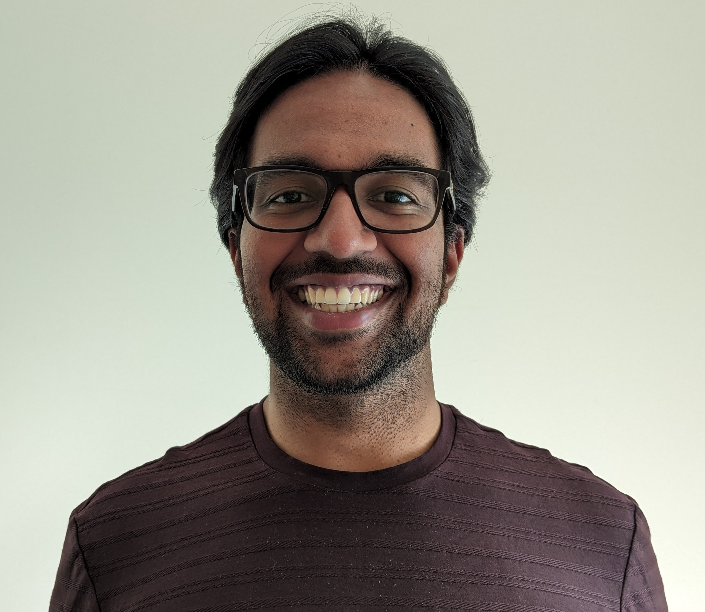

---
# Feel free to add content and custom Front Matter to this file.
# To modify the layout, see https://jekyllrb.com/docs/themes/#overriding-theme-defaults

layout: home
---

{: height="200px" width="230px" style="float:left; padding-right:20px" }

Welcome! I am a fourth-year PhD student at MIT, where I am very fortunate to be advised by [Vinod Vaikuntanathan](https://people.csail.mit.edu/vinodv). I am broadly interested in theoretical computer science, particularly quantum algorithms, coding theory, and cryptography.

Previously, I worked as a quantitative research analyst at Citadel Securities. Before that, I completed my undergraduate degree in mathematics at Princeton University in 2021, where I had the pleasure of being advised by [Matt Weinberg](https://www.cs.princeton.edu/~smattw/). See my [CV](CV.markdown) for more information.

Email: first initial last name at mit dot edu

 
## Recent News
- _October 2026:_ [Noah Shutty](https://research.google/people/noahshutty/) and I uploaded [manuscript](https://arxiv.org/abs/2610.00502) designing quantum algorithms for variants of optimal polynomial intersection that work with Reed–Muller codes and with global nonlinear constraints.
- _October 2026:_ I gave talks at NTT Research and the Charles River Crypto Day on the crazy summer that unclonable encryption has had, based on the below work with Prabhanjan Ananth and Amit Sahai, and a line of wonderful follow-up works by [Archishna Bhattacharyya, Anne Broadbent, and Eric Culf](https://arxiv.org/abs/2607.28561); [Andrea Colandagelo, Qipeng Liu, and Ziyi Xie](https://eprint.iacr.org/2026/1742); and [Prabhanjan Ananth](https://arxiv.org/abs/2608.19091).
- _September 2026:_ [Prabhanjan Ananth](https://sites.google.com/site/prabhanjanva/home), [Amit Sahai](https://web.cs.ucla.edu/~sahai/), and I posted a [merged version](https://arxiv.org/abs/2607.21551) of our unclonable encryption result over the summer.
- _July 2026:_ Peter Hall wrote [an article](https://www.scientificamerican.com/article/ai-helped-produce-two-proofs-for-the-same-cryptography-problem/) for Scientific American discussing the above results on unclonable encryption and how AI is changing the way we do research.
- _July 2026:_ [Aparna Gupte](https://www.mit.edu/~agupte/) and I uploaded a [manuscript](https://eccc.weizmann.ac.il/report/2026/126/) giving better server-communication tradeoffs for private information retrieval with 4 or more servers.

 
## Resources
If you are interested in learning about quantum algorithms, I hope some of the below slides might be useful!
- [Sid Jain](https://sidjain.me/) and I gave an introductory tutorial for a [workshop](https://sites.google.com/view/quantumfocs2025/home) at FOCS 2025. We start from classic ideas underlying Shor's integer factoring algorithm and Grover's search algorithm, and outline how principles from these have been extended to yield new quantum algorithms in recent years. Slides are available [here](slides/focs25-workshop-tutorial.pdf).
- For a less technical and higher-level overview of what we know about quantum algorithms for factoring integers, see [these slides](slides/cryptoday25-factoring-sota.pdf) or [this video recording](https://www.youtube.com/watch?v=TVev-BYtPX8&ab_channel=MITSchwarzmanCollegeofComputing).
- If you are a mathematician or number theorist, you might find [these slides](slides/unsw25-jacobi.pdf) more beneficial. A key open problem highlighted here is that of finding better classical algorithms for factoring integers of the form $N = P^2Q$ where $P, Q$ are primes and $Q \ll P$. As far as I know, the current state of the art is due to [this paper](https://arxiv.org/abs/2308.06130) by Erik Mulder.

 
# Publications
*In most publications here, author ordering is alphabetical as is the convention in theoretical computer science and mathematics. Exceptions are indicated with asterisks next to the first author's/authors' name(s).*

**Exponentially Fewer-Server PIR from Sparser S-Decoding Polynomials** [[arXiv]](https://arxiv.org/abs/2607.22033) [[ECCC]](https://eccc.weizmann.ac.il/report/2026/126/) [[ePrint]](https://eprint.iacr.org/2026/1515) 
[Aparna Gupte](https://www.mit.edu/~agupte/) and **SR** 
SODA 2027 

**Two-Server Private Information Retrieval in Sublinear Time and Quasilinear Space** [[ePrint]](https://eprint.iacr.org/2025/2008) [[Eurocrypt]](https://link.springer.com/chapter/10.1007/978-3-032-25330-9_3) [[code]](https://github.com/ahenzinger/finite-diffs-pir) 
[Alexandra Henzinger](https://people.csail.mit.edu/ahenz/) and **SR** 
Eurocrypt 2026, highlights talk at ITC 2026 

**Parallel Spooky Pebbling Makes Regev Factoring More Practical** [[arXiv]](https://www.arxiv.org/abs/2510.08432) [[ePrint]](https://eprint.iacr.org/2025/1887) [[Eurocrypt]](https://link.springer.com/chapter/10.1007/978-3-032-25291-3_14) [[code]](https://github.com/GregDMeyer/parallel-spooky-pebbling) 
[Greg Meyer](https://gmeyer.net/), **SR**, and Katherine Van Kirk 
Eurocrypt 2026, QIP 2026 

**Cloning Games, Black Holes and Cryptography** [[arXiv]](https://arxiv.org/abs/2411.04730) [[ePrint]](https://eprint.iacr.org/2024/1826) [[ITCS]](https://drops.dagstuhl.de/entities/document/10.4230/LIPIcs.ITCS.2026.109)  
[Alex Poremba](https://scc1.bu.edu/poremba/), **SR**, and [Vinod Vaikuntanathan](https://people.csail.mit.edu/vinodv) 
ITCS 2026, QIP 2026 

**The Jacobi Factoring Circuit: Quantum Factoring with Near-Linear Gates and Sublinear Space and Depth** [[arXiv]](https://arxiv.org/abs/2412.12558) [[ePrint]](https://eprint.iacr.org/2024/2034) [[STOC]](https://dl.acm.org/doi/10.1145/3717823.3718273) 
[Greg Meyer](https://gmeyer.net/), **SR**, [Vinod Vaikuntanathan](https://people.csail.mit.edu/vinodv), and Katherine Van Kirk 
STOC 2025, QIP 2026 
Featured on [Lakshmi Chandrasekaran's blog](https://scieye.wordpress.com/2025/06/07/beyond-cryptography-the-use-of-factorization-to-evaluate-the-power-of-a-quantum-computer/) 

**Indistinguishability Obfuscation from Bilinear Maps and LPN Variants** [[ePrint]](https://eprint.iacr.org/2024/856) [[TCC]](https://link.springer.com/chapter/10.1007/978-3-031-78023-3_1) 
**SR**, [Neekon Vafa](https://neekonvafa.com/), and [Vinod Vaikuntanathan](https://people.csail.mit.edu/vinodv) 
TCC 2024 
Featured on [Lakshmi Chandrasekaran's blog](https://scieye.wordpress.com/2026/01/15/constructing-indistinguishability-obfuscation-schemes-in-a-hardness-rich-world/) 

**Space-Efficient and Noise-Robust Quantum Factoring** [[Journal of Cryptology]](https://link.springer.com/article/10.1007/s00145-026-09572-x) [[public PDF link]](https://rdcu.be/e2mnc) 
**SR** and [Vinod Vaikuntanathan](https://people.csail.mit.edu/vinodv) 
Journal of Cryptology, merge of the following two papers:
- **Space-Efficient and Noise-Robust Quantum Factoring** [[arXiv]](https://arxiv.org/abs/2310.00899) [[ePrint]](https://eprint.iacr.org/2023/1501) [[CRYPTO]](https://link.springer.com/chapter/10.1007/978-3-031-68391-6_4) 
  CRYPTO 2024 
  **Best Paper Award** 
  Mentioned in [Quanta Magazine](https://www.quantamagazine.org/thirty-years-later-a-speed-boost-for-quantum-factoring-20231017/) and [MIT News](https://news.mit.edu/2024/toward-code-breaking-quantum-computer-0823) 
- **Regev Factoring Beyond Fibonacci: Optimizing Prefactors** [[ePrint]](https://eprint.iacr.org/2024/636) 

**On the cut-query complexity of approximating max-cut** [[arXiv]](https://arxiv.org/abs/2211.04506) [[ICALP]](https://drops.dagstuhl.de/entities/document/10.4230/LIPIcs.ICALP.2024.115) 
Orestis Plevrakis, **SR**, and [Matt Weinberg](https://www.cs.princeton.edu/~smattw/) 
ICALP 2024 

**A proof of the triangular Ashbaugh-Benguria-Payne–Pólya–Weinberger inequality** [[arXiv]](https://arxiv.org/abs/2009.00927) [[JST]](https://ems.press/journals/jst/articles/7525210) [[code]](https://github.com/sragavan99/triangle-ppw-inequality)  
Ryan Arbon, Mohammed Mannan, [Michael Psenka](https://www.michaelpsenka.io/), and **SR** 
Journal of Spectral Theory, 2022 

**Morphology-Aware Meta-Embeddings for Tamil** [[NAACL]](https://aclanthology.org/2021.naacl-srw.13/) 
Arjun Sai Krishnan\* and **SR**\* 
NAACL Student Research Workshop, 2021 

 
# Manuscripts

**Quantum Algorithms for OPI Variants Beyond Locality and Classical Decodability** [[arXiv]](https://arxiv.org/abs/2610.00502) 
**SR** and [Noah Shutty](https://research.google/people/noahshutty/) 

**A Fourier-Label Information-Loss Barrier for Dihedral Coset Algorithms** [[arXiv]](https://arxiv.org/abs/2609.40062) [[ePrint]](https://eprint.iacr.org/2026/1693) 
[Aparna Gupte](https://www.mit.edu/~agupte/), **SR**, and [Mark Zhandry](https://mzhandry.github.io/) 
Previously titled **The ePrint:2026/1591 Quantum Algorithm Does Not Solve DCP** 

**Unconditional Unclonable Encryption** [[arXiv]](https://arxiv.org/abs/2607.21551) 
[Prabhanjan Ananth](https://sites.google.com/site/prabhanjanva/home), **SR**, and [Amit Sahai](https://web.cs.ucla.edu/~sahai/) 
Merged from **Efficient Unclonable Encryption from Pauli Eigenstates** [[arXiv]](https://arxiv.org/abs/2607.21811) 

**Optimization Using Locally-Quantum Decoders** [[arXiv]](https://arxiv.org/abs/2604.24633) 
[Noah Shutty\*](https://research.google/people/noahshutty/), [Avijit Mandal](https://aviemathelec1995.github.io/), **SR**, Quentin Buzet, [André Chailloux](https://who.paris.inria.fr/Andre.Chailloux/), [Nicholas C. Rubin](https://ncrubin.github.io/), Abid Khan, Sami Boulebnane, [Ruslan Shaydulin](https://shaydul.in/), [John Azariah](https://johnazariah.github.io/), and Stephen P. Jordan 

**Catalytic Tree Evaluation From Matching Vectors** [[arXiv]](https://arxiv.org/abs/2602.14320) [[ECCC]](https://eccc.weizmann.ac.il/report/2026/022/) [[ePrint]](https://eprint.iacr.org/2026/265) 
[Alexandra Henzinger](https://people.csail.mit.edu/ahenz/), [Ted Pyne](https://sites.google.com/view/tedpyne/), and **SR** 
Highlights talk at ITC 2026 

 
# Talks

**Unconditional Unclonable Encryption**
- Charles River Crypto Day (October 2026)
- NTT Research (September 2026)

**The ePrint:2026/1591 Quantum Algorithm Does Not Solve DCP**
- Google Quantum AI Seminar (August 2026)

**Time-Space Tradeoffs for PIR and PIR for Time-Space Tradeoffs** [[slides made jointly with Alexandra]](slides/simons26-pir-and-tree-eval.pdf)
- ITC 2026 (August 2026, [slides](slides/itc26-pir-and-tree-eval.pdf))
- Simons Institute Crypto Reunion Workshop (July 2026)

**Catalytic Tree Evaluation from Matching Vectors** [[slides]](slides/ias26-treeeval.pdf)
- Harvard-MIT Sublinear Reading Group (April 2026)
- Institute for Advanced Study, Computer Science and Discrete Mathematics Seminar (April 2026, [video](https://www.youtube.com/watch?v=05yB2A_BgUs))

**Parallel Spooky Pebbling Makes Regev Factoring More Practical** [[slides made jointly with Greg and Katherine]](slides/eurocrypt26-spooky-pebbling.pdf)
- Eurocrypt 2026 (May 2026, with [Greg Meyer](https://gmeyer.net/), [slides](slides/eurocrypt26-spooky-pebbling.pdf))
- QuEra Computing (March 2026, [slides](slides/quera26-spooky-pebbling.pdf))

**Quantum Algorithms, Old and New** [[slides]](slides/focs25-workshop-tutorial.pdf)
- FOCS 2025, tutorial for a workshop on [Breaking and Making Quantum Speedups](https://sites.google.com/view/quantumfocs2025/home) (December 2025, with [Sid Jain](https://sidjain.me/))

**Two-Server Private Information Retrieval in Sublinear Time and Quasilinear Space** [[slides made jointly with Alexandra]](slides/eurocrypt26-pir.pdf)
- Eurocrypt 2026 (May 2026, [slides](slides/eurocrypt26-pir.pdf))
- Boston University Security Seminar (February 2026, [slides](slides/bu26-pir.pdf))
- MIT CIS Seminar (November 2025, with [Alexandra Henzinger](https://people.csail.mit.edu/ahenz/), [slides](slides/cisf25-2pir.pdf))
- MIT Simple Person's Applied Mathematics Seminar (October 2025)

**The Jacobi Factoring Circuit: Classically Hard Factoring in Sublinear Quantum Space and Depth** [[latest slides]](slides/iqmvt26-jacobi.pdf)
- Simons Institute (July 2026, [slides](slides/simons26-lowspacefactoring-jacobi.pdf))
- Virginia Tech Quantum Seminar (February 2026, [slides](slides/iqmvt26-jacobi.pdf))
- IQM Quantum Machine Learning Seminar (February 2026, [slides](slides/iqmvt26-jacobi.pdf))
- QIP 2026 (January 2026, with Katherine Van Kirk, [slides](slides/qip26-jacobi.pdf))
- Tufts Quantum Computing Seminar (September 2025, with [Greg Meyer](https://gmeyer.net/))
- UNSW Number Theory Days (August 2025, [slides](slides/unsw25-jacobi.pdf))
- Ruhr University Bochum Quantum Information Workshop (April 2025)
- Simons Institute Quantum Colloquium (March 2025, [slides](slides/simons25-jacobi.pdf), [video](https://www.youtube.com/watch?v=TA32tEow2Ug&list=PLgKuh-lKre11rEOFaO62MJCzBXfjZSDqA&index=1&ab_channel=SimonsInstitute))
- MIT Quantum Information Seminar (March 2025)
- CMU Theory Seminar (March 2025)

**Cloning Games, Black Holes and Cryptography** [[slides]](slides/qip26-cloning.pdf)
- QIP 2026 (January 2026)
- Kyoto University Quantum Cryptography Workshop (October 2025, [video](https://www2.yukawa.kyoto-u.ac.jp/~tomoyuki.morimae/KyotoQcrypt2/Ragavan.mp4))
- CMU CyLab Crypto Seminar (March 2025, [video](https://youtu.be/-T_9OLcJ9a8))

**Factoring with a Quantum Computer: The State of the Art** [[latest slides]](slides/uts25-factoring-sota.pdf)
- University of Technology Sydney (August 2025, [slides](slides/uts25-factoring-sota.pdf))
- University of Sydney (August 2025)
- QuEra Computing (April 2025, with [Greg Meyer](https://gmeyer.net/) and Katherine Van Kirk)
- MIT Schwarzman College of Computing Cryptography and Security Day (January 2025, [slides](slides/cryptoday25-factoring-sota.pdf), [video](https://www.youtube.com/watch?v=TVev-BYtPX8&ab_channel=MITSchwarzmanCollegeofComputing))

**Indistinguishability Obfuscation from Bilinear Maps and LPN Variants** [[slides]](slides/cisf24-io.pdf)
- MIT CIS Seminar (September 2024)

**Space-Efficient and Noise-Robust Quantum Factoring** [[slides]](slides/crypto24-factoring.pdf)
- CRYPTO 2024 (August 2024)
- IBM Quantum Seminar (November 2023)
- Yale Quantum Institute (November 2023)

**The Cut-Query Complexity of Approximating Max-Cut** [[slides]](slides/icalp24-maxcut.pdf)
- ICALP 2024 (July 2024)

 
# Teaching and Service

- Program Committee Member, [QIP 2026](https://qip2026.lu.lv/)
- Workshop Co-organiser, [Breaking and Making Quantum Speedups](https://sites.google.com/view/quantumfocs2025/home) at [FOCS 2025](https://focs.computer.org/2025/)
- Teaching Assistant, 6.1200 Mathematics for Computer Science (MIT, Fall 2025)
- Teaching Assistant, COS 445 Economics and Computing (Princeton, Spring 2019)